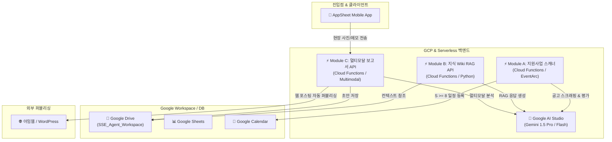

# 🗺️ 00_architecture_spec.md: SSE AI 에이전트 서비스 기술 명세 및 로드맵

이 문서는 **사회연대경제(SSE) AI 에이전트 서비스**의 전체 아키텍처 명세 및 세부 모듈 설계, 그리고 단계별 개발 로드맵을 정의합니다. 본 사양은 Antigravity 가상 에이전트 개발자 팀이 코드를 작성할 때 구현의 표준 지침서 역할을 수행합니다.

---

## 🏗️ 전체 아키텍처 개요 (System Architecture)

본 시스템은 **AppSheet(No-Code UI)**를 진입점으로 삼고, **Google Workspace API(Calendar, Drive, Sheets)**와 **GCP(Google Cloud Functions)**, 그리고 **Google AI Studio (Gemini 1.5 Pro / Flash)**를 결합하여 자동화된 자율 행정 에이전트를 구축합니다.

---

## 🛠️ 모듈별 세부 설계 사양 (Module Specifications)

### 📋 Module A: 지원사업 자동 스캐너 (Grant Scanner)
* **목적**: 정보 습득이 느린 SSE 조직을 대신하여 매일 아침 맞춤형 지원사업 공고를 탐색하고 캘린더에 연동합니다.
* **상세 플로우**:
  1. **스크래핑**: 지정된 사회연대경제 포털 혹은 정부 지원사업(예: 기업마당 등) 공고 페이지를 크롤링합니다.
  2. **에이전트 규칙 적용**: `.agent/rules/Agent_Grant_Searcher.md`에 명시된 적합도 평가 기준(조직의 관심 분야, 지원 자격 요건 등)을 로드합니다.
  3. **평가 ($S$)**: Gemini API를 이용해 공고 내용과 매칭율을 계산하여 $S \in [1, 10]$ 점수를 매깁니다.
  4. **Google 캘린더 연동**: $S \ge 8$ 이상인 공고에 한해 마감 날짜를 제목으로 하여 Google Calendar에 일정을 자동 추가합니다.
  5. **알림 발송**: 마감 3일 전, Google Chat Webhook 또는 이메일을 활용해 리마인더 알림을 발송합니다.

### 📚 Module B: Google Drive 기반 지식 위키 (Knowledge Wiki RAG)
* **목적**: 사내 규정, 정관, 총회 의사록 등 로컬에 흩어진 문서를 클라우드에 모아 실시간 행정 자문 비서로 활용합니다.
* **상세 플로우**:
  1. **작업 공간**: `SSE_Agent_Workspace/02_Knowledge_Wiki/` 폴더 내에 마크다운(`.md`) 파일 형태로 문서를 동기화합니다.
  2. **컨텍스트 로더**: Python Backend에서 Google Drive API를 사용해 해당 디렉토리 내의 최신 파일들을 동기화하여 읽어옵니다.
  3. **Gemini Long Context Window**: 별도의 복잡한 DB 임베딩 과정 없이, Gemini 1.5 Pro의 초대형 컨텍스트 창(1M+ tokens)을 이용해 마크다운 문서 전체를 컨텍스트 프롬프트로 한 번에 입력하여 정확한 팩트 기반 질의응답을 구현합니다.

### 📸 Module C: 현장 사진 기반 자동 보고서 및 사이트 포스팅 (Multimodal Reporter)
* **목적**: 현장 활동가가 모바일로 현장 사진과 간단한 메모만 전송해도, 사내 톤앤매너에 맞는 블로그 기사와 현장 보고서를 작성합니다.
* **상세 플로우**:
  1. **AppSheet 입력**: 활동가가 AppSheet 앱을 통해 이미지 파일과 메모(키워드 중심)를 등록합니다.
  2. **웹훅 수신**: AppSheet가 GCP Cloud Functions 엔드포인트로 웹훅(Webhook) 요청을 발송합니다.
  3. **멀티모달 분석**: Gemini 1.5 Pro에 사진 이미지와 메모를 함께 입력하고, `Agent_Reporter.md`의 보고서 작성 톤앤매너 룰을 적용해 고품질 블로그 초안(Markdown)을 작성합니다.
  4. **초안 보관**: `SSE_Agent_Workspace/05_Output_Drafts/`에 결과물을 저장합니다.
  5. **웹사이트 퍼블리싱**: 관리자가 승인한 콘텐츠는 아임웹(I'm Web) 또는 WordPress API를 연동하여 자동으로 공식 사이트에 업로드합니다.

---

## 🎯 개발 로드맵 (Development Roadmap)

- [ ] **Phase 1: 인프라 구축 및 뼈대 세팅**
  - Git 레포지토리 초기화 및 GitHub 퍼블릭 저장소 배포 (진행 중)
  - Google Drive 동기화 폴더 및 에이전트 동작 룰(`Agent_Grant_Searcher.md`, `Agent_Reporter.md`) 작성
- [ ] **Phase 2: Module A (지원사업 스캐너) 구현**
  - 공고 스크래핑 크롤러 개발 (BeautifulSoup / Playwright)
  - Gemini API 연동 및 적합도 스코어링 프롬프트 체인 설계
  - Google Calendar API 및 Google Chat Webhook 연동
- [ ] **Phase 3: Module B (지식 위키 RAG) 구현**
  - Google Drive API 연동 코드 작성 (폴더 파일 탐색 및 다운로드)
  - Markdown 문서 구문 분석기 구축
  - Gemini Long Context RAG 기반 질의응답 엔드포인트 구축
- [ ] **Phase 4: Module C (AppSheet & 멀티모달 포스팅) 구현**
  - AppSheet 웹훅 연동용 백엔드 서버 구축
  - Gemini 1.5 Pro 멀티모달 분석 및 초안 생성 프롬프트 정제
  - 아임웹 / WordPress API 연동 및 자동 퍼블리싱 로직 구현
