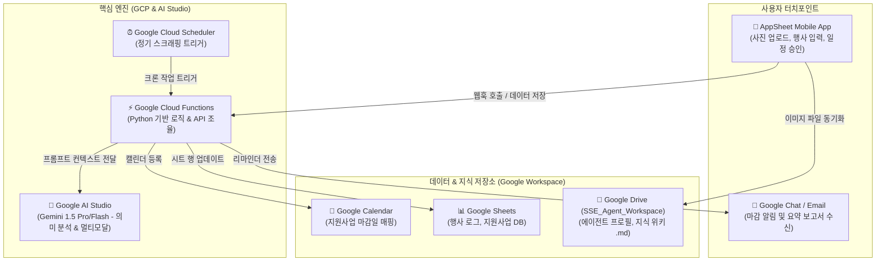

# 📋 기술 명세 및 개발 로드맵: 사회연대경제 AI 에이전트 서비스

> **Technical Specification & Development Roadmap for SSE AI Agent Service**

본 문서는 Google Workspace, GCP, 그리고 Google AI Studio(Gemini)를 통합하여 사회연대경제(SSE) 조직들의 행정업무를 자동화하고 지식을 자산화하는 에이전트 시스템의 아키텍처 및 구현 가이드라인을 정의합니다.

이 문서를 Antigravity(gstack) 환경에 직접 주입하여 순차적으로 코드를 생성하고 빌드할 수 있습니다.

---

## 1. 아키텍처 개요 (System Architecture)

전체 시스템은 서버리스 기반의 백엔드(GCP)와 사용하기 편리한 노코드 프론트엔드(AppSheet), 그리고 조직원들이 손쉽게 관리할 수 있는 파일 기반의 지식 허브(Google Drive)로 결합되어 작동합니다.



* **사용자 터치포인트**:
  * **AppSheet**: 현장 사진 업로드, 행사 데이터 입력, 질문 작성, 일정 확인 및 승인
  * **Google Chat / Email**: 마감 알림 및 요약 보고서 수신
* **데이터 & 지식 저장소 (Google Workspace)**:
  * **Google Drive**: `SSE_Agent_Workspace` 폴더 내 에이전트 동작 룰 및 지식 위키 마크다운 파일 보관
  * **Google Sheets**: 행사 로그, 지원사업 DB, 메타데이터 관리
  * **Google Calendar**: 지원사업 마감일 자동 등록 및 동기화
* **핵심 엔진 (GCP & AI Studio)**:
  * **Google Cloud Scheduler**: 정기적인 크롤링 및 백엔드 스캐너 실행 트리거
  * **Google Cloud Functions**: Python 기반 서버리스 백엔드로 API 오케스트레이션 수행
  * **Google AI Studio**: Gemini 1.5 Pro / Flash API를 호출해 비정형 데이터 의미 분석 및 멀티모달 보고서 생성

---

## 2. 구글 드라이브 폴더 및 파일 구조 (MD-Based Workspace)

에이전트는 드라이브 내부의 특정 마크다운(`.md`) 파일들을 실시간으로 읽어 자신의 역할과 정책을 동적으로 변경합니다.

```
📁 SSE_Agent_Workspace/
│
├── 📁 01_Agent_Profiles/               # 에이전트별 행동 규칙 정의
│   ├── 📄 Agent_Grant_Searcher.md      # 지원사업 검색 조건 및 적합성 필터링 룰
│   └── 📄 Agent_Reporter.md            # 보도자료 및 행사보고서 톤앤매너 룰
│
├── 📁 02_Knowledge_Wiki/               # 사내 지식 베이스 (RAG 연동)
│   ├── 📄 사내_운영_규정.md
│   ├── 📄 24년도_정기총회_의사록.md
│   └── 📄 지원금_집행_및_정산_매뉴얼.md
│
├── 📁 03_Task_Queue/                   # 에이전트 수동 업무 지시함
│   └── 📄 [대기]_하반기_기획서_검토.md
│
├── 📁 04_AppSheet_Media/               # AppSheet로 업로드한 현장 사진 저장소
│   └── 🖼️ EVT_20260716_01.jpg
│
└── 📁 05_Output_Drafts/                # 에이전트가 생성한 결과물 임시 저장소
    └── 📄 [초안]_성동구_사회적기업_장터_보고서.md
```

---

## 3. 핵심 에이전트 모듈별 상세 스펙

### 📋 Module A: 지원사업 스캐너 및 캘린더 등록 에이전트
* **목적**: 매일 정부/지자체 지원사업을 탐색하고, 우리 조직에 적합한 사업을 자동 분류하여 캘린더에 등록합니다.
* **작업 흐름**:
  1. **트리거**: Google Cloud Scheduler가 매일 아침 8시 Cloud Functions를 실행합니다.
  2. **크롤링**: Cloud Functions는 지정된 공공 포털(기업마당, 지자체 고시공고 등)을 크롤링하거나 RSS 피드/공개 API를 통해 공고 목록을 수집합니다.
  3. **룰 분석**: `Agent_Grant_Searcher.md` 파일에서 조직의 현재 타겟 업종, 필요 분야, 제외 조건 등의 필터 정보를 파싱합니다.
  4. **AI 매칭**: Gemini API를 호출하여 각 공고의 적합도 점수($S \in [1, 10]$)를 평가하고 3줄 요약본을 도출합니다.
  5. **캘린더 등록**: $S \ge 8$ 점 이상인 경우에 한해, Google Calendar API를 사용하여 마감일 일정을 자동 등록합니다.
  6. **알림 및 예약**: 마감일 기준 3일 전에 알림(이메일 또는 Google Chat Webhook)을 발송하도록 리마인더를 설정합니다.

### 📚 Module B: Google Drive 마크다운 지식 위키 (RAG 챗봇)
* **목적**: 사내 문서들을 기반으로 신뢰할 수 있는 정보를 제공하는 사내 AI 비서입니다.
* **작업 흐름**:
  1. **질문 접수**: 사용자가 AppSheet 질문창이나 슬랙/구글챗을 통해 "정기총회 서명 양식은 어디에 있지?"라고 질문합니다.
  2. **문서 동기화**: Cloud Functions가 `02_Knowledge_Wiki/` 폴더 내의 마크다운 파일들의 텍스트를 읽어옵니다.
  3. **컨텍스트 구성**: Gemini의 초대형 Context Window(최대 2M 토큰)를 활용하여, 폴더 내 주요 `.md` 전체 텍스트와 사용자의 질문을 통째로 컨텍스트로 전달합니다. (경량화 및 리소스 절약이 필요한 경우, 간단한 벡터 임베딩 후 Cosine Similarity 검색 필터링 적용)
  4. **답변 생성**: Gemini가 문맥을 참조하여 "사내_운영_규정.md 파일의 제3조 2항에 따르면..."과 같이 명확하게 출처를 밝히며 신뢰할 수 있는 답변을 생성합니다.

### 📸 Module C: 현장 사진 기반 자동 보고서 및 사이트 포스팅 에이전트
* **목적**: 현장 사진을 올리면 행사 결과 보고서 초안을 작성하고 웹사이트에 퍼블리싱 대기 상태를 만듭니다.
* **작업 흐름**:
  1. **현장 입력**: 현장 직원이 모바일 AppSheet에서 `[사진 업로드, 행사 키워드 입력]` 후 저장합니다.
  2. **웹훅 기동**: AppSheet의 Automation (Webhook)이 GCP Cloud Functions를 즉시 호출합니다.
  3. **데이터 수집**: GCP 백엔드는 업로드된 이미지 바이너리 데이터와 `Agent_Reporter.md`에 적힌 톤앤매너 규칙 프로필을 함께 읽어옵니다.
  4. **멀티모달 가공**: Gemini 1.5 Pro(멀티모달)를 호출하여 사진 속 분위기, 현장감, 입력된 키워드를 유기적으로 조합해 공식 보도자료 및 블로그 포스팅용 완성형 초안(`.md`)을 생성합니다.
  5. **승인 대기**: 작성된 초안을 `05_Output_Drafts/`에 저장한 뒤, AppSheet 대시보드에 승인 대기 상태로 노출시킵니다.
  6. **자동 퍼블리싱**: 관리자가 AppSheet에서 `[승인 및 발행]` 버튼을 클릭하면, 웹사이트(예: 아임웹, WordPress) API를 연동하여 자동으로 공식 블로그 또는 웹페이지에 포스팅을 발행합니다.

---

## 4. 데이터베이스 스키마 정의 (Google Sheets 기준)

### 📊 Sheet 1: `T_Grant_Master` (지원사업 목록)

| 필드명 | 데이터 타입 | 설명 |
| :--- | :--- | :--- |
| **grant_id** (PK) | VARCHAR | 지원사업 고유 ID |
| **title** | VARCHAR | 지원사업 공고명 |
| **link** | VARCHAR | 공고 안내 URL |
| **due_date** | DATE | 신청 마감 기한 |
| **suitability_score** | INTEGER | AI가 평가한 매칭 적합도 점수 ($S \in [1, 10]$) |
| **reason** | TEXT | 에이전트가 제시한 추천 사유 및 3줄 요약 |
| **status** | VARCHAR | 진행 상태 (`검토중` / `지원예정` / `포기`) |

### 📊 Sheet 2: `T_Event_Report` (행사 보고 목록)

| 필드명 | 데이터 타입 | 설명 |
| :--- | :--- | :--- |
| **event_id** (PK) | VARCHAR | 행사 보고 고유 ID |
| **event_name** | VARCHAR | 행사명 / 이벤트 제목 |
| **date** | DATETIME | 일시 및 시간 |
| **photo_url** | VARCHAR | 구글 드라이브 내 이미지 파일 링크 |
| **raw_notes** | TEXT | 활동가가 작성한 러프한 키워드 및 현장 메모 |
| **ai_draft_path** | VARCHAR | 생성된 결과물 초안 마크다운 파일 경로 |
| **published_status** | VARCHAR | 퍼블리싱 발행 상태 (`대기` / `완료`) |

---

## 🚀 Antigravity 개발 구현 로드맵 (4단계 스프린트)

### 🏃 스프린트 1: 로컬 개발 환경 구성 및 에이전트 역할 설정
* **내용**: 에이전트 개발을 위한 기본 룰 폴더를 구성하고, 로컬 디렉토리 환경과 Google AI Studio API 키 등의 환경 변수를 준비합니다.

### 🏃 스프린트 2: Module A 개발 (GCP Cloud Functions & 스크래퍼)
* **Antigravity 지시 프롬프트**:
  > "00_architecture_spec.md 파일의 'Module A' 스펙을 읽어봐. 특정 고시공고 웹사이트 RSS 피드를 스크래핑한 뒤, 구글 드라이브의 'Agent_Grant_Searcher.md' 파일의 규칙을 분석해 적합도를 매기는 파이썬 스크립트를 작성해 줘. 그리고 이 정보를 바탕으로 Google Calendar API를 호출해 마감일 일정에 등록하는 코드까지 하나의 파이프라인으로 구현해 줘."

### 🏃 스프린트 3: Module B 개발 (Drive MD 기반 RAG 엔진)
* **Antigravity 지시 프롬프트**:
  > "00_architecture_spec.md 파일의 'Module B' 스펙에 정의된 구글 드라이브 기반 RAG 위키 기능을 구현하고 싶어. 구글 드라이브 API를 통해 '02_Knowledge_Wiki' 폴더의 모든 마크다운 파일을 파싱해 텍스트 컨텍스트로 구성하고, 사용자가 입력한 프롬프트 질문에 가장 부합하는 답변을 마크다운 파일들의 정보를 기반으로 답해주는 파이썬 백엔드 코드를 작성해 줘."

### 🏃 스프린트 4: Module C 개발 (AppSheet 연동 멀티모달 & 퍼블리셔)
* **Antigravity 지시 프롬프트**:
  > "AppSheet에서 웹훅으로 전달받은 사진 파일(구글 드라이브 경로)과 직원이 메모한 텍스트를 파싱하는 API 엔드포인트를 짜줘. 이 이미지와 텍스트를 Gemini 1.5 Pro 멀티모달 모델에 넘겨서 블로그 포스팅용 초안으로 가공하게 만들고, 최종 결과물을 '05_Output_Drafts' 폴더에 저장하는 로직까지 연동해 줘."
